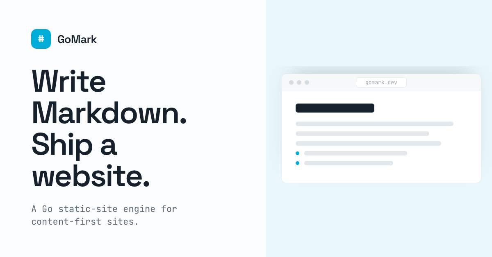

# gomark



Build a markdown-powered website in Go with batteries included: routing, rendering,
navigation, search, sitemap, robots, static site assets, and runnable Go examples
that execute right in the reader's browser.

Read the docs at [gomark.dev](https://gomark.dev).

## Install

```bash
go get github.com/arivictor/gomark@latest
```

GoMark is a single importable package: `github.com/arivictor/gomark`.

## Quick Start

Create `main.go` in your project:

```go
package main

import (
	"log"

	gm "github.com/arivictor/gomark"
)

func main() {
	s := gm.NewSite(
		gm.WithSiteTitle("My Docs"),
		gm.WithSiteContentDir("content"),
		gm.WithSiteMode(gm.PreRender),
	)

	if err := s.Start(); err != nil {
		log.Fatal(err)
	}
}
```

The HTTP server is part of the package. You do not need to set one up yourself
for the default use case.

## Write your docs

Create a `content` directory and add markdown files. The file structure maps to
the URL structure. For example, `content/docs/hello.md` is served at `/docs/hello`.

```markdown:title="content/docs/hello.md"
# Hello, World!

Welcome to my docs site.
```

You can create index pages with `index.md` files. For example, `content/docs/index.md` is served at `/docs/`.